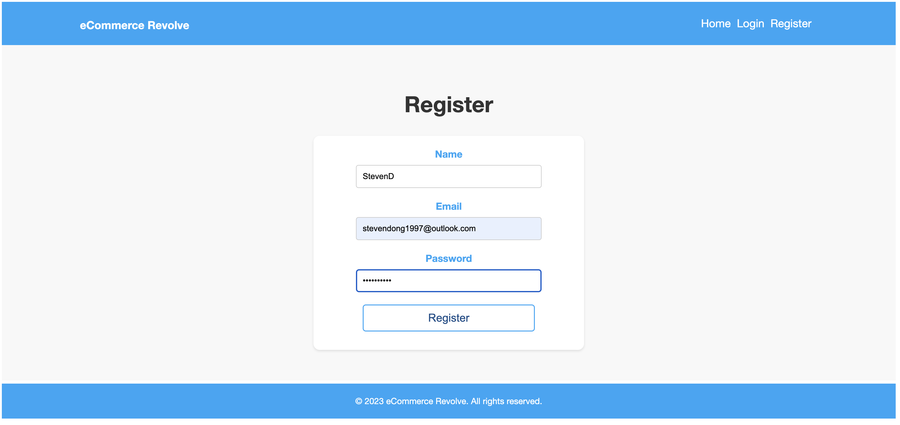

# EcomRevolve

[](https://opensource.org/licenses/MIT)

## Description

This app allows users to view and review their experiences with ecommerce marketplaces in AUS/NZ.

Welcome to EcomRevolve, the ultimate hub for sharing captivating stories and reviews in the world of Australian e-commerce. This platform is dedicated to showcasing the customer journey, with a focus on shipping period, user locations, and the value range of orders. Powered by the MERN framework, EcomRevolve takes you on an exciting expedition through the vast of online shopping.

Join our vibrant community, where shoppers from all corners of Australia share their experiences, providing valuable insights and overall customer satisfaction. With EcomRevolve, you'll unlock the secrets of the Australian e-commerce landscape, making informed decisions and embarking on a seamless shopping adventure. Step into our virtual marketplace today and let the revolution begin!

## Table of Contents

- [Installation](#installation)
- [Usage](#usage)
- [Technology](#technology)
- [Credits](#credits)
- [License](#license)

## Installation

Please follow the below link for the deployed app on Heroku
(link)

Alternativelyt, if fork from github, please follow the below steps:
Install the initial package

```md
npm i
```

Seed data

```md
npm run seed
```

Deploy app

```md
npm run develop
```

Then open the localhost to test the app.

## Usage

User flow for EcommerceRevolve:


When a user landing on the Homepage, there are marketplaces options being provided to the users


When a user click into one of the landing page, they are presented the information for the marketpalce and user reviews


When a user that's not logged in and click on add review CTA, they are presented with the register or login request


After user clicks on the CTA for login or register they are then directed to the below pages

LogIn Page:


Register Page:


Logged in user can then add a review with the review form


addationally, the homepage below shows the login CTA on the navagition bar has been updated for the logged in user to logout


After review being added, the user then being driected back to the landing page can delete or edit their review


## Technology

- MERN framework
- GraphQL with a Node.js and Express.js server
- MongoDB and the Mongoose ODM for the database
- Queries and mutations for retrieving, adding, updating, and deleting data
- Heroku
- JWT

### Future Development

- Enable CTA from marketplace page
- Enable product carousel on landing page
- Fast checkout for users

## Credits

- Steven Dong (https://github.com/StevenDong2512)
- Shiby Mathew (https://github.com/Shiby-Mathew)

## License

[](https://opensource.org/licenses/MIT)

### Copyright © 2023 [Steven Dong](https://github.com/StevenDong2512) & [Shiby Mathew](https://github.com/Shiby-Mathew)

```md
Permission is hereby granted, free of charge, to any person obtaining a copy
of this software and associated documentation files (the "Software"), to deal
in the Software without restriction, including without limitation the rights
to use, copy, modify, merge, publish, distribute, sublicense, and/or sell
copies of the Software, and to permit persons to whom the Software is
furnished to do so, subject to the following conditions:

The above copyright notice and this permission notice shall be included in all
copies or substantial portions of the Software.

THE SOFTWARE IS PROVIDED "AS IS", WITHOUT WARRANTY OF ANY KIND, EXPRESS OR
IMPLIED, INCLUDING BUT NOT LIMITED TO THE WARRANTIES OF MERCHANTABILITY,
FITNESS FOR A PARTICULAR PURPOSE AND NONINFRINGEMENT. IN NO EVENT SHALL THE
AUTHORS OR COPYRIGHT HOLDERS BE LIABLE FOR ANY CLAIM, DAMAGES OR OTHER
LIABILITY, WHETHER IN AN ACTION OF CONTRACT, TORT OR OTHERWISE, ARISING FROM,
OUT OF OR IN CONNECTION WITH THE SOFTWARE OR THE USE OR OTHER DEALINGS IN THE
SOFTWARE.
```
